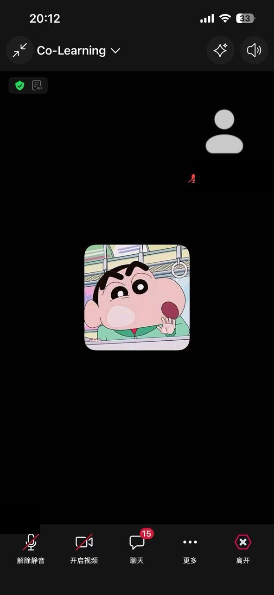

# 2026-07-13｜Week 2：Dev Builder 定方向与 Moss 开源学习

## 今天完成了什么

今天进入 Monad Builder Camp Week 2。我先没有急着开启新的大功能，而是把本周方向定为 **Dev Builder**，并围绕“AI 如何更安全地协助链上操作”整理了角色选择、AI 协作记录和开源学习材料。

我阅读了 Moss 的 README、Getting Started、Agent Skill Guide、Protocol Onboarding 和贡献规范。Moss 把 Monad 上复杂的协议交互整理成 `discover → load → action → simulate` 的流程：Agent 发现能力、读取参数与风险、生成未签名 Plan、模拟核对实际效果，最后仍由用户的钱包确认。

这和我此前在 Monad Testnet 做 ERC-4337 Sponsor 与 ERC-7702 受限 Executor 时的学习方向是连贯的。我的关注点不只是“让 AI 能够调用合约”，而是怎样把交易意图、目标范围、授权额度、Gas 责任、模拟结果和最终确认拆开处理，并留下可复查的 Proof。

## 今天的收获

我最认可 Moss 的两个边界：

1. **模拟是必须的，但不是保证。** 模拟会把实际资金流、approval、接收方等效果与 Plan 中声明的 `expects` 对账。出现 warning 时必须停止；但即使没有 warning，仍需要对照用户原本的意图，不能把技术检查当成用户授权。
2. **工具不持有签名权。** Moss 不保存私钥、不签名、不发送交易。用户的钱包仍是最终确认点。这种边界也提醒我，后续做任何 Agent / 钱包体验时，都不能让后端或 Agent 变成不受限制的执行者。

## 开源协作准备

我浏览了 Moss 的 GitHub 目录、文档、Issue 和贡献规范。目前关注的是 [Issue #16：新手 Quick Start 改进建议](https://github.com/nishuzumi/moss/issues/16)。项目已有较完整的入门文档，所以我不会重复已有内容；下一步会先核对 README 到 Getting Started 的衔接和常见失败排查，确认一个具体、小范围、可验证的贡献点后，再提交真实的 Issue 或 PR。

## 今天的材料

- [角色选择与 AI 协作记录](../notes/week2/2026-07-13-role-and-ai-collaboration.md)
- [Moss 学习笔记、GitHub 探索与开源贡献计划](../notes/week2/2026-07-13-moss-open-source.md)
- [Moss 官方仓库](https://github.com/nishuzumi/moss)

## 实时活动记录

### Web3 技术如何从 0 到 1 用 AI 开发

我实时参加了「Web3 技术如何从 0 到 1 用 AI 开发」分享。截图中是会议进行中的共享屏幕，手机时间为 19:48；顶部会议标题显示为“Web3 技术分享:如何从 0...”。画面中的课件主题是“智能合约开发：把规则写成确定性状态机”，并提到了 EVM、Gas、Solidity / Vyper、Foundry / Hardhat / Anvil 等开发相关内容。

这场分享让我更明确：AI 可以帮助拆解需求、生成代码初稿和辅助 Debug，但智能合约中的规则、权限和状态变化仍必须由开发者理解并通过测试验证。接下来我会继续把今天的 Dev Builder 方向落实为可验证的 Monad Testnet 实验与公开学习记录。

### 7.13 Co-learning

我实时参加了 7.13 Co-learning。截图显示会议标题为 “Co-Learning”，手机时间为 20:12，会议仍在进行中。

这次 Co-learning 的下一步行动是：把当天的角色选择、Role Log、AI Collaboration Log 和活动证据整理到同一份学习记录中，不只停留在听完分享，而是让每次共学都沉淀为可以回看的材料。

## 下一步

1. 继续完成一次真实 GitHub 开源协作；
2. 整理各项任务对应的公开链接，提交 WCB 前逐项核对。
